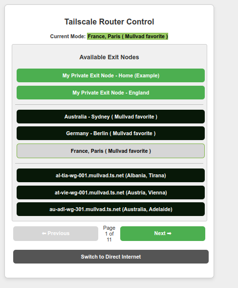

# 🛠 Tailscale Raspberry Router

**Tailscale Raspberry Router** is a project that turns a Raspberry Pi or any Linux device into a **Tailscale-powered VPN Router**. It enables devices on a local network to route their traffic through **Tailscale exit nodes**, including **Mullvad VPN nodes** and **Private Exit Nodes**.



This project allows:
- **Seamless integration with Tailscale**
- **Easy switching between direct internet & Tailscale exit nodes**
- **Running on Raspberry Pi & Linux Desktops**
- **Multi-interface support (e.g., `eth0`, `wlan0`, `wlan1`)**
- **Web Dashboard for controlling exit nodes** 🌍
- **Support for Private Exit Nodes for self-hosted VPN routing**
- **Recommends `dnsmasq` for DHCP on a second interface if needed**
- **Creates a VPN router for secure traffic routing over Tailscale**
- **Useful for securing devices that require a stable VPN connection**

---

## **🚀 Features**
✅ **Use a Raspberry Pi or any Linux device as a Tailscale-powered VPN router**  
✅ **Dynamic detection of available exit nodes (including Mullvad VPN & Private Exit Nodes)**  
✅ **Real-time web dashboard to switch between exit nodes**  
✅ **Persistent mode saving (restores the last used exit node on startup)**  
✅ **Auto-detects and configures the primary network interface (e.g., `eth0`, `wlan0`)**  
✅ **Runs as a systemd service for automatic startup**  
✅ **Supports two network interfaces (one for WAN, one for LAN clients) but works with just one**  
✅ **Allows external DHCP configuration (e.g., `dnsmasq` for local clients)**  
✅ **Supports `friendly-names.json` to assign friendly names to exit nodes**  
✅ **Acts as a VPN router for devices needing secure and consistent VPN connections**  
✅ **Web-based authentication with session management for secure access**  

---

## **💻 Installation & Setup**

### **Bare device — one command (recommended)**

On a **fresh** Raspberry Pi / Debian system with network and `curl` or `wget`, run as root:

```sh
curl -fsSL https://raw.githubusercontent.com/pmozdzynski/tailscale-raspberry-router/main/scripts/bootstrap-device.sh | sh
```

Or with `wget`:

```sh
wget -qO- https://raw.githubusercontent.com/pmozdzynski/tailscale-raspberry-router/main/scripts/bootstrap-device.sh | sh
```

This script (`scripts/bootstrap-device.sh`) will:

1. Install **git**, **curl**, **ca-certificates**, and **Go** via `apt`
2. **Clone** this repository to `/opt/tailscale-raspberry-router-src`
3. **Compile** the binary (auto-detects Pi 1 `GOARM=6`, Pi 2/3 `GOARM=7`, etc.)
4. Run **`install.sh`** — installs the app and starts the systemd service

At the end it prints URLs like:

```
http://192.168.x.x:5000/setup
```

Open that in a browser to finish configuration (WAN/LAN, DHCP, Tailscale auth key, admin password).

> **Note:** The device IP comes from your home router/ISP DHCP and may be unknown beforehand. The script lists every IPv4 address it finds. If none appear yet, connect Ethernet, wait a moment, then run `ip -4 addr show`.

Optional environment variables:

```sh
REPO_URL=https://github.com/you/fork.git \
REPO_DIR=/opt/tailscale-raspberry-router-src \
BRANCH=main \
  sh bootstrap-device.sh
```

On very low-memory Pis (Pi 1), enable swap before building if compilation fails:

```sh
sudo dphys-swapfile swapoff
sudo sed -i 's/^CONF_SWAPSIZE=.*/CONF_SWAPSIZE=512/' /etc/dphys-swapfile
sudo dphys-swapfile setup && sudo dphys-swapfile swapon
```

---

### **Quick install (repo already on device)**

If you already cloned the repo (or copied files via `scp`):

```sh
cd tailscale-raspberry-router

# Option A — build on another machine, copy binary here (Pi 1 example):
# GOOS=linux GOARCH=arm GOARM=6 go build -o tailscale-raspberry-router main.go

# Option B — full bootstrap from repo (installs git/go if missing):
sudo ./scripts/bootstrap-device.sh

# Option C — binary already built, app install only:
sudo ./scripts/install.sh
```

`install.sh` only copies the app and starts the service. **dnsmasq, Tailscale, iptables, and LAN config are installed by the web wizard.**

Open the setup wizard:

```
http://<device-ip>:5000/setup
```

If the IP is unknown, find it with `ip -4 addr show` or your router's DHCP client list.

The wizard will:
- **Auto-detect interfaces and default route** (WAN stays on existing DHCP)
- **Suggest a LAN subnet** that does not overlap the WAN network
- **Install missing packages** via apt (dnsmasq, iptables, curl, Tailscale)
- Configure **LAN static IP + DHCP + DNS forwarding**
- Connect **Tailscale** (auth key required on fresh installs)
- Set **dashboard login** credentials

After setup, use the dashboard at `http://<device-ip>:5000/` to switch exit nodes.

To reconfigure from scratch, remove `/etc/tailscale-router/config.json` and restart the service.

---

### **Manual install**

#### **1️⃣ Install & Authenticate Tailscale**
```sh
curl -fsSL https://tailscale.com/install.sh | sh
```
Then, authenticate your device:
```sh
sudo tailscale up
```

### **2️⃣ Clone the Repository & Compile for Your Platform**
```sh
git clone https://github.com/pmozdzynski/tailscale-raspberry-router.git
cd tailscale-raspberry-router
```
#### **Cross-Platform Build for Raspberry Pi and Linux Devices**
To build for different architectures, use the appropriate `GOARCH` and `GOARM` flags:
```sh
# For Raspberry Pi 4 (ARM64)
GOOS=linux GOARCH=arm64 go build -o tailscale-raspberry-router main.go

# For Raspberry Pi 3/2/1 (32-bit ARM)
GOOS=linux GOARCH=arm GOARM=7 go build -o tailscale-raspberry-router main.go

# For x86_64 Linux Desktops
GOOS=linux GOARCH=amd64 go build -o tailscale-raspberry-router main.go
```
Move the compiled binary:
```sh
sudo mkdir -p /opt/tailscale-raspberry-router/templates/
sudo mv tailscale-raspberry-router /opt/tailscale-raspberry-router/
sudo mv templates/* /opt/tailscale-raspberry-router/templates/
```

### **3️⃣ Set Up the Systemd Service**
```sh
sudo nano /etc/systemd/system/tailscale-router.service
```
Paste the following:
```
[Unit]
Description=VPN Router Service
After=network-online.target tailscaled.service systemd-networkd-wait-online.service
Wants=network-online.target tailscaled.service systemd-networkd-wait-online.service
Before=shutdown.target

[Service]
Type=idle
ExecStartPre=/bin/sh -c 'echo "Starting Tailscale Router service, please wait..." | systemd-cat -t tailscale-router'; /bin/sleep 15
ExecStart=/opt/tailscale-raspberry-router/tailscale-raspberry-router
WorkingDirectory=/opt/tailscale-raspberry-router/
Restart=always
RestartSec=5
User=root

[Install]
WantedBy=multi-user.target
```
Enable and start:
```sh
sudo systemctl daemon-reload
sudo systemctl enable tailscale-router.service
sudo systemctl start tailscale-router.service
```
> **Note:** The service takes approximately **15-30 seconds** to start due to the sleep delay and tailscale/interfaces detection. Please wait before attempting to access the Web UI.

Then, access the Web UI at: 
```
http://<your-device-ip>:5000
```

> **Note:** The router automatically optimizes routing changes by flushing ARP and routing caches. If `arping` is installed (`sudo apt-get install iputils-arping`), it will use gratuitous ARP announcements for even faster updates, but it's not required - the router works fine without it.

### **🔐 Authentication**

The Web UI is protected by authentication. When you first access the dashboard, you'll be redirected to a login page.

**Default Credentials:**
- **Username:** `admin`
- **Password:** `admin`

> **⚠️ Security Note:** Change the default credentials in production using environment variables (see below).

**Customizing Credentials:**

You can set custom credentials using environment variables. Edit the systemd service file:
```sh
sudo nano /etc/systemd/system/tailscale-router.service
```

Add environment variables in the `[Service]` section:
```
[Service]
Type=idle
Environment="AUTH_USERNAME=myusername"
Environment="AUTH_PASSWORD=mypassword"
Environment="SESSION_SECRET=your-secret-key-here-min-32-chars"
ExecStartPre=/bin/sh -c 'echo "Starting Tailscale Router service, please wait..." | systemd-cat -t tailscale-router'; /bin/sleep 15
ExecStart=/opt/tailscale-raspberry-router/tailscale-raspberry-router
...
```

Then reload and restart:
```sh
sudo systemctl daemon-reload
sudo systemctl restart tailscale-router.service
```

**Environment Variables:**
- `AUTH_USERNAME` - Custom username (default: `admin`)
- `AUTH_PASSWORD` - Custom password (default: `admin`)
- `SESSION_SECRET` - Session encryption key (recommended for production, minimum 32 characters)

**Features:**
- Browser password saving support (autocomplete enabled)
- Session-based authentication (7-day sessions)
- Secure cookie storage
- Logout functionality available in the dashboard

Use this interface to log in and select an **exit node**.

Please note: You must have at least 1 active Exit node on your account to see anything it in router web-UI. You can check them here https://login.tailscale.com/admin/machines  
If you do not have any own Exit nodes, you can get paid Mullvad addon from https://login.tailscale.com/admin/settings/general

---

## **🔒 Using an Exit Node for LAN Clients**

This device cannot act as an exit node but can route all connected LAN clients through a Tailscale Exit Node. It functions as a router for LAN clients, forwarding their traffic through an external Tailscale Exit Node rather than terminating VPN connections itself.

### **Selecting an Exit Node via Web Interface**

1️⃣ Open the Web Dashboard:
```
http://<your-device-ip>:5000
```
2️⃣ Choose an available **exit node** from the list.


3️⃣ Click **Apply** to route all LAN traffic through the selected exit node.

### **Verify Connection**
To ensure that LAN clients are routing traffic through the selected exit node, run the following command on any connected client:
```sh
curl ifconfig.me
```
The output should match the external IP of the selected exit node.

---

## **🌐 LAN DNS (dnsmasq + Tailscale exit nodes)**

LAN clients should use the Pi as DNS (`192.168.50.1`). The Pi forwards upstream to either **NetworkManager** (direct mode) or **Tailscale MagicDNS** (`100.100.100.100`) when an exit node is active.

### **1️⃣ Point dnsmasq at a managed upstream file**

If you already use NetworkManager on Debian 13, change **one line** in `/etc/dnsmasq.conf`:

```
# Before (ISP DNS only — won't follow exit node in Mode 2):
# resolv-file=/run/NetworkManager/no-stub-resolv.conf

# After:
no-resolv
resolv-file=/run/tailscale-router/upstream.conf
```

See `configs/dnsmasq-eth1.conf.example` for a full LAN config.

### **2️⃣ Install DNS helper scripts**

```sh
sudo install -m 755 scripts/update-dns.sh /usr/local/bin/update-dns.sh
sudo install -m 755 scripts/tailscale-dns-watch.sh /usr/local/bin/tailscale-dns-watch.sh
sudo update-dns.sh   # creates /run/tailscale-router/upstream.conf from NM
sudo systemctl restart dnsmasq
```

### **3️⃣ Optional: watch Tailscale in the background**

Reloads dnsmasq when Tailscale connects/disconnects or exit node changes:

```sh
sudo cp configs/tailscale-dns-watch.service /etc/systemd/system/
sudo systemctl daemon-reload
sudo systemctl enable --now tailscale-dns-watch.service
```

The Go router also runs `update-dns.sh` whenever you switch exit nodes in the web UI.

### **Verify DNS path**

```sh
cat /run/tailscale-router/upstream.conf
resolvectl status 2>/dev/null || true
```

On a LAN client after selecting an exit node, DNS should resolve via the exit node's network (Mullvad DNS, etc.).

---

## **🐝 Cross-Platform Compatibility**
This project supports multiple architectures, including:
- **Raspberry Pi 4 (ARM64)**
- **Raspberry Pi 3/2 (ARM32 with GOARM=7)**
- **Raspberry Pi 1 (ARMv6 with GOARM=6)**
- **x86_64 Linux Desktops**
- **Other Linux-based single-board computers**

Ensure you compile the binary for the correct architecture before deployment.

---

## **🌍 License**
```
MIT License

Copyright (c) 2025 P.S. Mozdzynski

Permission is hereby granted, free of charge, to any person obtaining a copy
of this software and associated documentation files (the "Software"), to deal
in the Software without restriction, including without limitation the rights
to use, copy, modify, merge, publish, distribute, sublicense, and/or sell
copies of the Software, and to permit persons to whom the Software is
furnished to do so, subject to the following conditions:

The above copyright notice and this permission notice shall be included in all
copies or substantial portions of the Software.

THE SOFTWARE IS PROVIDED "AS IS", WITHOUT WARRANTY OF ANY KIND, EXPRESS OR
IMPLIED, INCLUDING BUT NOT LIMITED TO THE WARRANTIES OF MERCHANTABILITY,
FITNESS FOR A PARTICULAR PURPOSE AND NONINFRINGEMENT. IN NO EVENT SHALL THE
AUTHORS OR COPYRIGHT HOLDERS BE LIABLE FOR ANY CLAIM, DAMAGES OR OTHER
LIABILITY, WHETHER IN AN ACTION OF CONTRACT, TORT OR OTHERWISE, ARISING FROM,
OUT OF OR IN CONNECTION WITH THE SOFTWARE OR THE USE OR OTHER DEALINGS IN THE
SOFTWARE.
```

---

## **💬 Need Help?**
Post an issue in the GitHub repository or ask in the **Tailscale community forums**!

